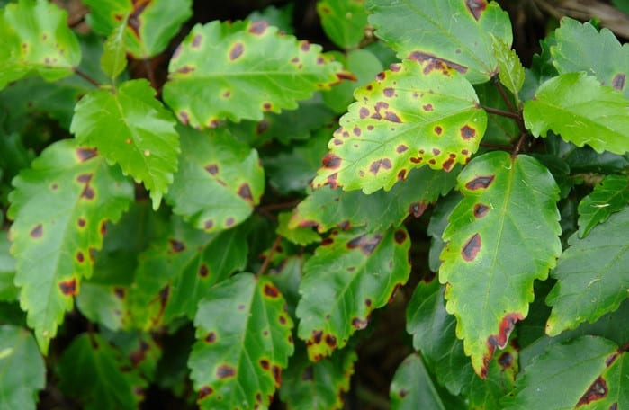

# 🌿 AI-Based Plant Disease Detection System

A deep learning project that automatically detects plant diseases from leaf images. Built with **TensorFlow/Keras** and deployed using **Streamlit**, this system helps farmers and agricultural researchers identify crop diseases early and provides actionable treatment advice.



## ✨ Features
*   **Real-Time Prediction:** Instant disease detection from uploaded images.
*   **Deep Learning Model:** Trained on over **26,000+ images** giving high accuracy.
*   **Comprehensive Info:** Provides symptoms, causes, and treatment steps for each disease.
*   **User-Friendly Interface:** Simple web UI built with Streamlit.

## 🔍 Supported Diseases (7 Classes)
The model can currently identify the following conditions:
1.  **Apple Scab**
2.  **Apple Black Rot**
3.  **Apple Cedar Rust**
4.  **Healthy Apple**
5.  **Potato Early Blight**
6.  **Potato Late Blight**
7.  **Healthy Potato**

## 📂 Dataset
The model was trained on the **New Plant Diseases Dataset**.
*   **Download here:** [Kaggle - New Plant Diseases Dataset](https://www.kaggle.com/datasets/vipoooool/new-plant-diseases-dataset)
*   *Note: The dataset folders (`train`, `valid`, `test`) are excluded from this repo to save space.*

## 🛠️ Installation & Usage

### 1. Clone the Repository
```bash
git clone https://github.com/prasadchaudhari2005/ML-Based-Plant-Disease-Detection-.git
cd ML-Based-Plant-Disease-Detection-
```

### 2. Install Dependencies
```bash
pip install -r requirements.txt
```

### 3. Setup Dataset & Model
1.  **Download Dataset:** Get the "New Plant Diseases Dataset" from Kaggle.
2.  **Extract Folders:** Place the `train`, `valid`, and `test` folders inside this project directory.
3.  **Train Model:**
    *   Open `training_model.ipynb` in Jupyter Notebook.
    *   Run all cells to train the model.
    *   This will generate the `trained_model_new.h5` file needed for predictions.

### 4. Run the Application
Once the model is trained and saved:
```bash
streamlit run main.py
```
This will open the web interface in your browser where you can upload leaf images for detection.

### 5. Testing
*   Open `test_plant_disease.ipynb` to evaluate the model's performance on the test set.

## 💻 Tech Stack
*   **Frontend:** Streamlit
*   **ML Framework:** TensorFlow, Keras
*   **Data Processing:** NumPy, Pandas, Pillow
*   **Visualization:** Matplotlib, Seaborn
